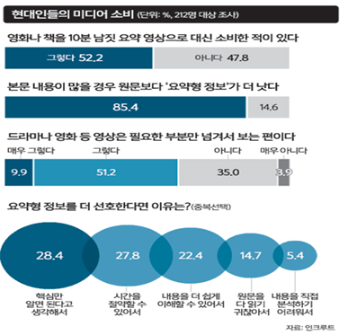
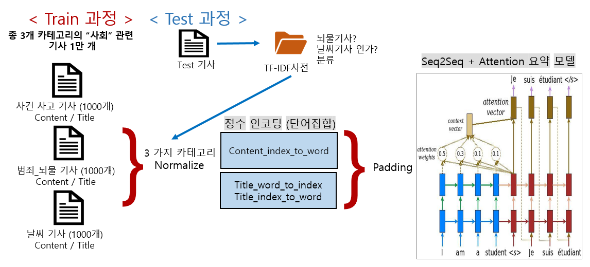
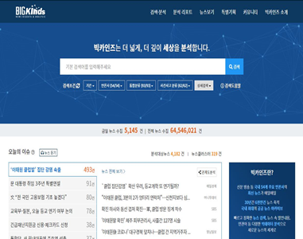
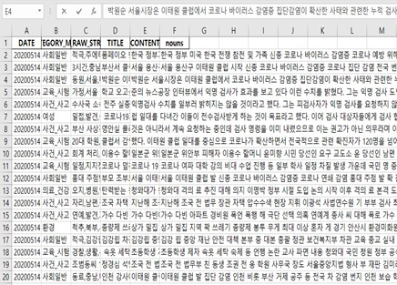
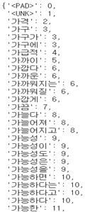
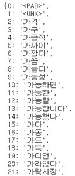
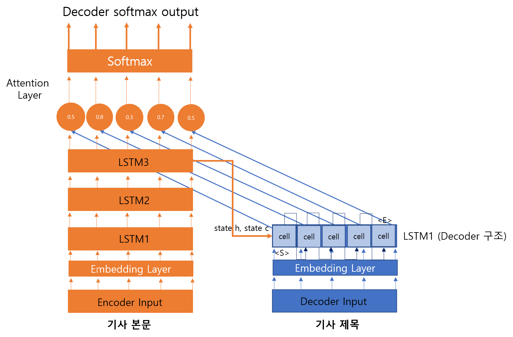
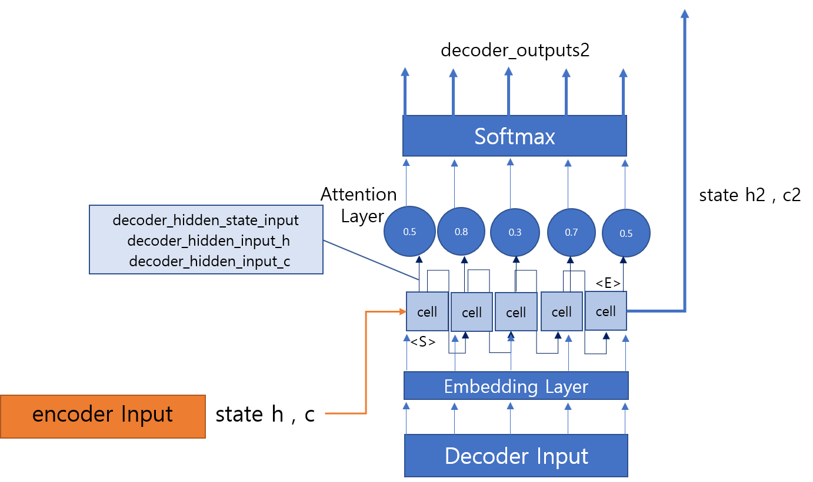
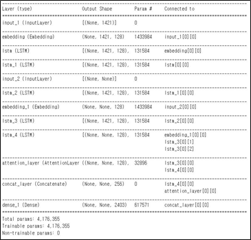

> ## 멀티캠퍼스 4차산업혁명 선도인력양성 과정
>
> ## 빅데이터(딥러닝) 활용 AI 설계

# 실전 프로젝트

> ## Seq2Seq 모델을 이용한 뉴스 기사 제목 생성
>
> ### 사회 관련 기사 중심으로

## 목차

1. [프로젝트 배경](#1._프로젝트_배경)
   - 프로젝트 선정 배경 및 목적
   - Text Summarization 개요
2. [프로젝트 수행절차 및 방법](#2._프로젝트_수행절차_및_방법)
3. [프로젝트 수행 과정 및 결과](#3._프로젝트_수행_과정_및_결과)
   - 데이터 수집
   - 데이터 전처리
   - Seq2Seq + Attention 모델
   - 프로젝트 수행 결과
4. [발전 방향](#4._발전_방향)
5. [부록](#5._부록)
   - 파일 소개

## 1. 프로젝트 배경

- 프로젝트 배경 및 목적

  

  - 현대인들의 미디어 소비, **요약형 정보**를 더 선호

- Text Summarization 목적

  > **텍스트 요약(Text Summarization)**이란
  >
  > - 상대적으로 큰 원문을 핵심 내용만 간추려서 작은 요약문으로 변환하는 것이다.
  > - 텍스트 요약은 크게 추출적 요약, 추상적 요약으로 나뉜다.
  > - 의미있는 모델링을 위하여 Seq2Seq 모델을 이용하여 추상적 요약을 진행하였다.

  - **추출적 요약**(Extractive Summarization)
    - 추출 요약은 원문에서 중요한 핵심 문장 또는 단어구를 몇 개 뽑아서 이들로 구성된 요약문을 만드는 방법이다.
    - 대표적인 알고리즘 : TextRank

  - **추상적 요약**(Abstractive Summarization)
    - 추상적 요약은 **원문에 없는 문장이라도 핵심 문맥을 반영한 새로운 문장을 생성**해서 원문을 요약하는 방법이다.
    - 주로 인공신경망을 사용하며, 추출적 요약보다는 난이도가 높다.
    - 추상적 요약을 인공신경망으로 훈련하기 위해서는 `'원문(X)'`뿐만 아니라 지도학습을 위한 `'실제 요약문(Y)'`이라는 레이블 데이터가 있어야 한다.
    - 대표적인 알고리즘 : Seq2Seq

## 2. 프로젝트 수행절차 및 방법

- 사전 기획
  
  - 주제 선정 및 기획
- 데이터 수집 및 전처리
  - 뉴스 기사 크롤링
    - 사회관련 총 3개의 카테고리 별 1000개의 기사
  - 문서의 단어 TF-IDF 사전 생성
    - 문서별, 전체 문서 키워드
- 모델 설계 및 구축
  - word_to_index, index_to_word 사전 생성
  - Seq2Seq 모델 생성
  - pipline 설계 및 구성
- 최종 Test
  - 모델 Test
  - 모델 성능 보안

- **Text suumarization 구성 및 모델 설계**

  

  

## 3. 프로젝트 수행 과정 및 결과

### 데이터 수집(Data Collection)

- BIGkinds 사이트에서 뉴스 기사 수집

  

- 1차 전처리 후 날짜, 카테고리, 키워드, 제목, 본문, 명사 본문 형태로 데이터 가공

  

### 데이터 전처리(Data Preprocessing)

#### Normalize / 정수 인코딩

- 텍스트를 숫자로 처리할 수 있게 하는 정수 인코딩 단어 집합을 구성

- `Konlpy.tag`의 `Komoran`으로 품사 태깅 작업 후 최대한 'index_to_word'를 줄이기 위해 비슷한 의미의 단어는 하나의 단어로 통일화 시키는 작업 진행

  |  | =>   |  |
  | ------------------------------------------------------------ | ---- | ------------------------------------------------------------ |
  | **예시** **)** **가구**,**가구가**,**가구에**                | =>   | **가구** (index 2)                                           |

#### Sequence Padding

- 인코딩한 텍스트 문장을 각 일정한 길이로 맞추기 위해 지정한 수치로 채우는 작업

### Seq2Seq + Attention 모델

- Seq2Seq + Attention 메커니즘 과정

  - train model

    

  - test model

  

  

- 모델 구성

  

  - 위의 모델 : Seq2Seq Model LSTM 4계층 + attention
    - 카테고리에 따라 3계층도 사용

  - Parameter Setting
    - Embedding Size : 256 or 128
    - Hidden : 128
    - Epoch : 50
    - Batch size : 64
    - Callback : EarlyStopping

### 프로젝트 수행 결과

#### 범죄_뇌물 기사

- Good Case

  | 예측 요약문                                              | 실제  제목                                        | 실제 기사 본문                                               |
  | -------------------------------------------------------- | ------------------------------------------------- | ------------------------------------------------------------ |
  | 유재수  감찰 무마 사건 가족 비리 재판 배당               | 유재수  감찰 수사 검찰서 진술 번복 윗선 외압 중단 | 유재수의 부산시 경제 금품 수수 의혹을 직접 감찰 전직 청와대 민정수석 특별  최근 검찰 조사에서는 윗선 지시로 감찰 무마 진술한 알리다 그는 그동안 외압  … (생략) |
  | 검찰 국정원 특활비 의혹 주범 집사 김백준 방조범으로 구속 | 국정원 특활비 수수 김진모 비서관 구속             | 서울중앙지법 특수 부장 송경호 **국가정보원장의  특수활동비 수수한 혐의** 특정  가중처벌까지 뇌물 업무 횡령 김진모 사진 청와대 민정 비서 구속 하다 비서 이른바 민간인 사찰 의혹  폭로한 장진수 총리 공직 주무관 국정 특활비를 만원 전달하려 관여한 혐의…(생략) |
  | 검찰  강원랜드 채용비리 권성동                           | 강원랜드  차례 수사 권성동 무죄                   | 강원랜드 채용 비리 혐의로 재판에 넘기다 권성동 사진 자유한국당도  의원 심에서 무죄를 선고받고 동안 검찰 사건 두다 차례 수사 벌이다  결국 초라한 결말을 맺다 강원랜드 채용 비리 사건 거스르다 올라가다  당시 강원랜드 자체 감사를 거치다 춘천지검 수사 의뢰 춘천지검 최흥집 사장 인사 불구속을 기소했다고 하지만 문재인 정부 들다 곳곳에 공기업  채용 비리 터지다 시민단체 의원의 연루 의혹을 제기 춘천지검 재수사에  나서다 ...(생략) |

- Bad Case

  | 예측 제목                                                    | 실제  제목                                              | 실제 기사 본문                                               |
  | ------------------------------------------------------------ | ------------------------------------------------------- | ------------------------------------------------------------ |
  | 미성년자 출입 무마 무마  무마  무마  무마  무마  무마  무마  무마  무마  무마  무마  무마  무마  유착 브로커 받다 송치 | 미성년자 클럽 무마 경찰 청탁 브로커 영장                | 서울 강남 클럽 미성년자 출입 무마 과정에서 클럽 경찰 사이에서 유착 고리  역할을 브로커 대하다 구속영장이 청구 서울 지능범죄수사대는 뇌물  혐의로 브로커 구속영장이 청구했다 밝히다 경찰 긴급 체포 조사 영장  신청했다 검찰은 경찰 신청한 영장 법원에 청구했다 경찰 서울 강남  클럽 미성년자 출입 처리 과정에서 수상한 발견하고 수사 나서다..(생략) |
  | 검찰 의혹 의혹 경찰 직원 미용사 이름도 빌리다                | 단독 검찰 포스코건설 압수수색 방음벽업체 선정 비리 의혹 | 김태우 스폰서 최모 뇌물 단서 최씨 포스코 업체 선정 관련  로비 정황 최씨 횡령 혐의 영장 청구 기각 검찰 민자 고속도로 공사 과정에서 방음벽 설치 관련 비리 정황을 포착해 수사..(생략) |
  | 검찰 김학의 사건 핵심 윤중천   대법관                        | 검찰 성범죄 뇌물수수액 혐의 김학의  차관 소환           | 김학의 사진 법무부 차관의 뇌물 성범죄 의혹 수사 검찰 차관에 소환 통보했다고 김학의 단장 여환섭 검사장   차관에 출석해 조사 받다 통보했다고 밝히다 차관은 검찰  출석 요구에 응하다 뜻을 밝히다 전하다 검찰은 차관 상대로 건설업자  윤중천씨에 성접대를 ..(생락) |

#### 날씨 기사

- Good Case

  | 예측 요약문                           | 실제  제목                                                  | 실제 기사 본문                                               |
  | ------------------------------------- | ----------------------------------------------------------- | ------------------------------------------------------------ |
  | 실시간 수도권 오후 현재 대체로 흐리다 | 실시간 전국 오전 현재 대체로 흐리다                         | 오전 현재 전국 영상 도의 기온 분포 보이다 대체 흐리다 비가 내리다 지역  많다 지역 날씨 다음 같다 서해 흐리다 기온 강수 … (생략) |
  | 전국 오후 전국 흐리다                 | 추석 연휴 마지막 전국 흐리다                                | 추석 연휴 일요 전국 흐리다 곳곳 비가 내리다 기상 사이 서해 위치 기압 영향 서울 경기 강원 영서 충청 전라 경상 서부 가끔  비가 오겠다 동해 위치 고기 가장 들다 동풍 영향 오후 강원 영동 경북 동해 비가 내리다…(생략) |
  | 태풍 솔릭 북상 한반도 상륙            | 기상청 정보만 의존 안한다  오다 초강력 태풍 솔릭  대비 사람 | 태풍 솔릭 한반도 관통 전망 태풍 대비 대하다 관심 뜨겁다 기상 따르다 이날  오전 현재 솔릭  제주 서귀포 부근 해상 이동 상태 솔릭 제주 서쪽 바다 지나다 오전 전남 목포 남서 부근 해상 통과 오전  속초 부근 지나다 동해 빠져나가다 보이다 한반도 전체 태풍 영향 들다 전국 매우 강하다 비바람 몰아치다 ...(생략) |

- Bad Case

  | 예측 요약문      | 실제  제목                                  | 실제 기사 본문                                               |
  | ---------------- | ------------------------------------------- | ------------------------------------------------------------ |
  | 전국 대체로 맑다 | 수능 하루 앞두다 한파 수험생들  결빙 주의   | 대학 하루 앞두다 밤부터 서울 비롯 곳곳 한파 내려지다 한파 전일 최저 기온 이상 떨어지다 평년 이상 낮을 예상 전국 비가  내리다 밤부터 기온 이상 크다 떨어지다 바람 강하다 불어 더욱 낮다 사이 내리다 비나 눈으로 수능 아침 도로 결빙 예상 수험생 미끄러지다  않도록 주의 필요 … (생략) |
  | 폭염             | 기상청 올봄 황사 발생 평년과 비슷           | 올봄  황사 발생 평년 비슷  예측 기상 따르다 올해 봄철 국내 황사 발생 평년 일과 비슷 보이다 황사 발원 기상 조건 발원 자체 평년 많다 우리 유입 가능  상대 작다 황사 발생 평년 비슷 김동준 기상 기후 황사 유입 있다 북서 봄철 전반 다소 약하다 …(생략) |
  | 서울   한파      | 전국 곳곳 가을비 중부 경북 최대 폭우 내리다 | 이틀 강수 예상 많다 비가  내리다 기온 평년 비슷  강하다 바람 비까지 겹치다 곳에 따르다 쌀쌀한 기운 느끼다 오전 최저 서울 춘천 대전 전주 광주 대구 부산 제주 비가 내리다 공기 청정 전국 대부분 지역 미세 농도 좋다 ...(생략) |

#### 사건_사고 기사

- Good Case

  | 예측 요약문                                    | 실제  제목                                         | 실제 기사 본문                                               |
  | ---------------------------------------------- | -------------------------------------------------- | ------------------------------------------------------------ |
  | 법정 출석 왜곡에 하나하나 하나하나  반박하겠다 | 조국 고소 재판 최강욱 김의겸 증인 출석 터무니 없다 | 서로 모르다 사이 여러 말씀 최강 비례 당선 오후 서울 도봉구 북부 열리다 재판 나오다 이렇다 말했다 조국 법무 장관 보수  성향 명예 고소 열리다 재판 당선 이날 재판 우씨 변호 사건 선고  재판 주심 판사 장관 식사 묻다 이를 강하다 부인 앞서 자신 유튜브  채널 거짓 진실 최서원의 개명 최순실 선고 직전…  (생략) |
  | 법정 불출석 정경심 건강 쇠약                   | 한인섭 정경심 재판 나오다 법원 정당한 사유 아냐    | 조국 법무 장관 부인 정경 동양 교수 재판 증인 채택 한인 법원 불출 사유 제출  원장 재판 하루 앞두다 공무 일정 이유 재판 출석 어렵다 밝히다 재판   재판  이날 원장 불출 사유 정당 않다며 이상 과태료 처하다 있다 입장  전하다 원장 공무 변경 어렵다 일정 다시 날짜 조정 재판 출석 말했다 원장 실제 출석 않을 경우 재판 원장 과태료 결정 내리다…(생략) |

- Bad Case

  | 예측 요약문       | 실제  제목                            | 실제 기사 본문                                               |
  | ----------------- | ------------------------------------- | ------------------------------------------------------------ |
  | 울리다   집행유예 | 오세훈 흉기 협박 남성 구속 발부       | 총선 출마 오세훈 후보 서울 유세 현장 흉기 들다 접근 난동 부리다 구속 서울  판사 이종훈 이날 특수 공직 선거 자유 방해 위반 혐의 받다 있다 구속 피의자 심문 영장 결과 구속 필요 인정 구속 발부 재판 범죄 혐의  내용 경과 비추다 구속 필요 상당 인정 판단 밝히다 오전 광진 자양동 차량 유세 벌이다 후보 향하다 미리 준비 흉기 들다 접근  현장 있다 경찰 곧바로 제압 후보 선거 운동 모두 다치다 않았다 경찰 조사 야간 근무 마치다 잠을 자다 선거 유세 수면 방해 홧김 범행  저지르다 … (생략) |
  | 법정 출석         | 이유 돌아가다 아버지 때려 숨지다 검거 | 아버지 때려 여성 경찰 붙잡히다 충북 존속 혐의 붙잡다 조사 있다 밝히다 경찰  따르다 전날 오후 제천 주택 아버지 폭행 숨지다 혐의 당시 경찰 아버지 이유 없이 돌아가다 신고 받다 현장 출동 하지만 경찰 아버지 머리  폭행 흔적 발견 현장 현행 체포 당시 술에 취하다 상태 전하다 범행 부인 있다 경찰 사인 밝히다 부검 의뢰 정확한 범행 동기 조사  …(생략) |

## 4. 발전 방향

- 아쉬운 점
  - 훈련을 위한 기사 데이터 선택 과정이 쉽지 않았다.
    - 많은 단어를 최소한의 단어 집합으로 만들기 위해 전처리 하는 과정에 많은 시간이 들었다.
  - 제한적인 Compute Engine 환경에서 최적의 한글 요약문을 생성할 수 있는 점에서 한계점이 존재했다.
    - 더 나은 환경을 위하여 ColabPro와 Azure Notebook 환경에서 끊임없이 최적의 예측값을 도출하기 위한 파라미터 조절 작업에 있어서 모든 팀원들이 함께 고민해가며 노력했다.
- 이번 프로젝트를 통해 배웠던 자연어 처리 요약 과정을 바탕으로 Azure Luis와 같은 현재 존재하는 Auto NLP를 활용하여 서비스화 하는데 응용해보고 싶다.

## 5. 부록

- 파일 소개
  - `get_url.py` : BIGkinds에서 해당 기사를 크롤링 하기 위한 url 주소들을 모은 csv 파일을 생성하는 코드이다.
  - `get_content.py` : `get_url.py`를 통해 얻은 url에 있는 기사내용을 크롤링 하는 코드, 결과를 .xlsx 파일로 저장한다.
  - `data_normalize.py` : 데이터 전처리 코드로, 숫자와 영어, 특수문자를 제거하여 .xlsx 파일로 저장한다.
  - `extract_nouns.py` : `konlpy.tags.Okt`를 이용하여 각 기사의 명사만 추출하여 .xlsx 파일로 저장하는 코드이다.
  - `get_TFIDF_top20.py` : `extract_nouns.py`의 수행결과로 생성된 명사 본문에 대하여 TFIDF를 수행하여 각 기사의 상위 20개의 단어를 추출하여 각 분야별로 결과를 저장하는 코드이다.
  - `generate_word_dict.py` : 데이터를 정수화 하기 위하여 필요한 `word_to_index`와 `index_to_word`를 각 분야별로 .pkl 파일로 생성하는 코드이다.
  - `generator_train_model.py` : 각 분야별마다 모델을 생성하여 학습한 후, 각 노드의 가중치 저장하는 코드이다.
  - `generate_pickle_for_category_classification.py` : 데이터가 들어왔을 때, 어떤 분야인지 분류하기 위해 TFIDF를 이용하여 생성한 단어 list 저장하는 코드이다.
  - `category_classification.py` : `generate_pickle_for_category_classification.py`의 결과로 얻은 단어 list를 이용하여, 입력된 데이터의 분야를 분류하는 함수 코드이다.
  - `generator_test_model.py` : 입력된 데이터가 분류된 분야에 맞는 모델을 생성하는 함수 코드이다.
  - `word_to_index_and_padding.py` : 입력된 데이터의 단어를 index로 바꿔주고, 본문의 길이를 맞춰주는 함수가 있는 코드이다.
  - `test.py` : 데이터를 훈련된 모델에 적용시켜 요약문을 생성해내고, index로 이루어진 본문과 요약문을 단어로 다시 바꿔주는 함수가 있는 코드이다.
  - `execute.py` : test를 실시할 데이터를 입력받고 test를 실시하는 코드로, 결과물(요약문)들이 출력되는 코드이다.