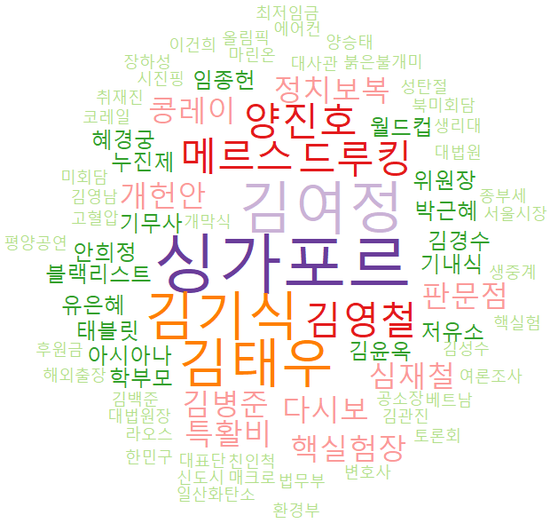

[toc]

# 1차 프로젝트(워드 클라우드)

## 각 방송국의 메인 뉴스 기사 제목을 이용한 자연어 처리

### 1. 분석하고자 하는 이유

- 해마다 주요한 키워드를 알아보기 위하여
- 방송사마다 키워드가 어떻게 다른지 살펴보기 위하여

### 2.  방송사 선정 기준

- 각 방송사의 메인 뉴스 프로그램일 것
- url 주소가 규칙적으로 변화할 것
- 웹 크롤링이 가능할 것

### 3. 데이터 수집

- 2015.01.01 ~ 2020.02.29까지의 데이터 수집
- R의 revest 패키지를 이용한 웹 크롤링

### 4. 데이터 전처리

- \[\]로 묶여있는 단어와 특수기호, 숫자를 제거하는 전처리 실시
- 일자별로 기사들을 한 줄로 연결하여 txt 파일로 저장
- 데이터를 다시 불러와서
  - 영어 제거
  - 특수문자 제거
  - 한자 제거
  - 불필요한 빈칸 제거

### 5. 분석 & 시각화(워드 클라우드)

- R의 KoNLP 패키지를 이용하여 명사 추출
- lR의 tm 패키지를 이용하여 TFIDF 분석 실시
- TFIDF의 결과에서 날짜마다 값이 가장 큰 5 단어 저장
- 2번 이상 나타난 단어에 대하여 워드 클라우드 그리기

#### 2015

|                             SBS                              |                             JTBC                             |                             YTN                              |
| :----------------------------------------------------------: | :----------------------------------------------------------: | :----------------------------------------------------------: |
|  |  |  |

#### 2016

|                             SBS                              |                             JTBC                             |                             YTN                              |
| :----------------------------------------------------------: | :----------------------------------------------------------: | :----------------------------------------------------------: |
|  |  |  |

#### 2017

|                             SBS                              |                             JTBC                             |                             YTN                              |
| :----------------------------------------------------------: | :----------------------------------------------------------: | :----------------------------------------------------------: |
|  |  |  |

#### 2018

|                             SBS                              |                             JTBC                             |                             YTN                              |
| :----------------------------------------------------------: | :----------------------------------------------------------: | :----------------------------------------------------------: |
|  |  |  |

#### 2019

|                             SBS                              |                             JTBC                             |                             YTN                              |
| :----------------------------------------------------------: | :----------------------------------------------------------: | :----------------------------------------------------------: |
|  |  |  |

#### 2020

|                             SBS                              |                             JTBC                             |                             YTN                              |
| :----------------------------------------------------------: | :----------------------------------------------------------: | :----------------------------------------------------------: |
|  |  |  |

- 2015년과 2016년의 메인 키워드는 비슷하지만 해가 지나갈수록 방송국마다 키워드들이 다르다는 것을 확인할 수 있다.
- 2020년의 경우 2달 동안의 데이터로 분석을 실시하여 '신천지'라는 메인 키워드는 동일하였지만, 주변을 둘러싼 키워드들을 통해 나중에 2020년 전체 데이터를 이용하여 분석을 실시하면 방송국마다 키워드들이 다를 것이라고 예상할 수 있다.

### 6. R shiny


- 이를 통하여 방송사와 년도를 각각 지정하여 워드 클라우드 결과를 볼 수 있습니다.

### 후에 하면 좋을 분석

- 잠재 의미 분석(Latent Semantic Analysis, LSA)
- 토픽 모델링(잠재 디리클레 할당, Latent Dirichelt Allocation, LDA)

# cf) 코드

## 웹 크롤링 & 저장

```R
library(rvest)
library(tm)
library(stringr)
```

- 데이터를 가져올 날짜 데이터 생성

```R
start_date = as.Date("2015-01-01")
end_date = as.Date("2020-02-29")
date_set = seq(as.Date(start_date), as.Date(end_date), by = "day")
date_set = format(date_set, format="%Y%m%d")
```

### sbs

- sbs news 크롤링 & 저장 test

```R
sbs_url = "https://news.sbs.co.kr/news/programMain.do?prog_cd=R1&broad_date=20200219"
sbs_html = read_html(sbs_url, encoding = "utf-8")

sbs_news = sbs_html %>%
  html_node("#container") %>% 
  html_node(".sn_section_w") %>%
  html_node(".snprg_list_w") %>%
  html_nodes(".spml_cont") %>% 
  html_nodes("span") %>% 
  html_text()

sbs_text = str_remove_all(sbs_news, "\\[.+\\]")
sbs_text = str_replace_all(sbs_text, 
                            "[[:punct:]]", " ")
sbs_text = str_replace_all(sbs_text, 
                           "[[:digit:]]", " ")

write(paste(sbs_text, collapse = " "), "sbs/sbs_20200219.txt")
```

- 반복문으로 작성

```R
for (day in date_set){
  sbs_url = "https://news.sbs.co.kr/news/programMain.do?prog_cd=R1&broad_date="
  sbs_html = read_html(paste0(sbs_url, day), 
                       encoding = "utf-8")
  
  # 뉴스 크롤링
  sbs_news = sbs_html %>%
    html_node("#container") %>% 
    html_node(".sn_section_w") %>%
    html_node(".snprg_list_w") %>%
    html_nodes(".spml_cont") %>% 
    html_nodes("span") %>% 
    html_text()
  
  if (length(sbs_news) != 0){
  # 뉴스 전처리
  sbs_text = str_remove_all(sbs_news, "\\[.+\\]")
  sbs_text = str_replace_all(sbs_text, 
                            "[[:punct:]]", " ")
  sbs_text = str_replace_all(sbs_text, 
                             "[[:digit:]]", " ")
  
  # 파일로 저장
  write(paste(sbs_text, collapse = " "),
        paste0("news/sbs/sbs_", day, ".txt"))
  }
  
  # 공격으로 인지 방지
  Sys.sleep(30)
}
```

### jtbc

```R
jtbc_url = "http://news.jtbc.joins.com/Replay/news_replay.aspx?fcode=PR10000403&strSearchDate=20200218"
jtbc_html = read_html(jtbc_url, encoding = "utf-8")

jtbc_news = jtbc_html %>% 
  html_nodes(".bd") %>% 
  html_nodes(".title_cr") %>% 
  html_text()

jtbc_text = str_remove_all(jtbc_news[-length(jtbc_news)], 
                           "\\[.+\\]")
jtbc_text = str_replace_all(jtbc_text,
                            "[[:punct:]]", " ")
jtbc_text = str_replace_all(jtbc_text, 
                           "[[:digit:]]", " ")
jtbc_text = str_replace_all(jtbc_text, "~", " ")
```

- 반복문

```R
for (day in date_set){
  jtbc_url = "http://news.jtbc.joins.com/Replay/news_replay.aspx?fcode=PR10000403&strSearchDate="
  jtbc_html = read_html(paste0(jtbc_url, day), 
                       encoding = "utf-8")
  
  # 뉴스 크롤링
  jtbc_news = jtbc_html %>% 
    html_nodes(".bd") %>% 
    html_nodes(".title_cr") %>% 
    html_text()
  
  if (length(jtbc_news) != 0){
  # 뉴스 전처리
  jtbc_text = str_remove_all(jtbc_news[-length(jtbc_news)],
                           "\\[.+\\]")
  jtbc_text = str_replace_all(jtbc_text,
                              "[[:punct:]]", " ")
  jtbc_text = str_replace_all(jtbc_text, 
                             "[[:digit:]]", " ")
  jtbc_text = str_replace_all(jtbc_text, "~", " ")
  
  # 파일로 저장
  write(paste(jtbc_text, collapse = " "),
        paste0("news/jtbc/jtbc_", day, ".txt"))
  }
  
  # 공격으로 인지 방지
  Sys.sleep(50)
}
```

### ytn

```R
ytn_url = "https://www.ytn.co.kr/news/news_night_list.php?mode=Day&day=20200219"
ytn_html = read_html(ytn_url, encoding = "utf-8")

ytn_news = ytn_html %>% 
  html_node(".wrap") %>% 
  html_node("#ytn_list_v2014") %>% 
  html_nodes(".news_list_v2014") %>% 
  html_node("dt") %>% 
  html_text()

ytn_text = str_remove_all(ytn_news, "\\[.+\\]")
ytn_text = str_replace_all(ytn_text, 
                            "[[:punct:]]", " ")
ytn_text = str_replace_all(ytn_text, 
                           "[[:digit:]]", " ")
```

- 반복문

```R
for (day in date_set){
  ytn_url = "https://www.ytn.co.kr/news/news_night_list.php?mode=Day&day="
  ytn_html = read_html(paste0(ytn_url, day), 
                       encoding = "utf-8")
  
  # 뉴스 크롤링
  ytn_news = ytn_html %>%
    html_node(".wrap") %>% 
    html_node("#ytn_list_v2014") %>% 
    html_nodes(".news_list_v2014") %>% 
    html_node("dt") %>% 
    html_text()
  
  if (length(ytn_news) != 0){
  
  # 뉴스 전처리
  ytn_text = str_remove_all(ytn_news, "\\[.+\\]")
  ytn_text = str_replace_all(ytn_text, 
                            "[[:punct:]]", " ")
  ytn_text = str_replace_all(ytn_text, 
                             "[[:digit:]]", " ")
  ytn_text = str_replace_all(ytn_text,
                             "\\+|↑|~", " ")
  
  # 파일로 저장
  write(paste(ytn_text, collapse = " "),
        paste0("news/ytn/ytn_", day, ".txt"))
  }
  
  # 공격으로 인지 방지
  Sys.sleep(50)
}
```

## 데이터 분석

### 데이터 불러오기

```R
ytn_location = "C:/Users/student/Desktop/R_script/news/ytn"
ytn_list = list.files(ytn_location)

ytn_data = data.frame()

for (file in ytn_list){
  temp = read.csv(paste0(ytn_location, "/",file), header = FALSE, 
                  stringsAsFactors = FALSE, sep = "\\")
  ytn_data = rbind(ytn_data, temp)
}
```

### 데이터 전처리

```R
ytn_corpus = str_replace_all(ytn_data, 
                             "[[:lower:]]", " ")
ytn_corpus = str_replace_all(ytn_corpus,
                             "[[:punct:]]", " ")
ytn_corpus = str_replace_all(
  ytn_corpus,
  "#|%|\\(|\\)|↑|↓|`|‘|’|“|”|\\＋|\\/|‥|○", " ")
ytn_corpus = str_replace_all(ytn_corpus,
                             "[[:space:]]+", " ")
# R shiny에서 전처리 방법 변경
```

### TFIDF 생성

```R
ytn_tfidf = DocumentTermMatrix(
  VCorpus(VectorSource(ytn_corpus)),
  control = list(weighting = function(x) weightTfIdf(x, normalize = FALSE)))
```

## KoNLP 패키지 사용 & 워드 클라우드

```R
library(rJava)
library(KoNLP)

library(SnowballC)
library(wordcloud)
```
### SBS
```R
# 데이터 불러오기
sbs_location = "C:/Users/student/Desktop/news/sbs"
sbs_list = list.files(sbs_location)

sbs_data = data.frame()
for(file in sbs_list){
  temp = read.csv(paste0(sbs_location,"/", file), header = FALSE, 
                  stringsAsFactors = FALSE, sep = "\\")
  sbs_data = rbind(sbs_data, temp)
}

# 데이터 전처리
sbs_data$year = substr(sbs_list, 5, 8)
sbs_2015 = sbs_data$V1[sbs_data$year == "2020"]
sbs_text = str_replace_all(sbs_2015, "[[:lower:]]", " ")
sbs_text = str_replace_all(sbs_text, "[[:upper:]]", " ")
sbs_text = str_replace_all(sbs_text, "[^[:alpha:][:digit:]]", " ") # 특수문자 제거
sbs_text = str_replace_all(sbs_text, "[\u4E00-\u9FD5o]", " ") # 한자 제거
sbs_text = str_replace_all(sbs_text, "[[:space:]]+", " ")

##########################3
# sbs_corpus = VCorpus(VectorSource(sbs_text))
# sbs_corpus = tm_map(sbs_corpus, stemDocument)
# 
# sbs_tfidf = DocumentTermMatrix(
#   sbs_corpus,
#   control = list(weighting = function(x) weightTfIdf(x, normalize = FALSE)))
# 
# sbs_tfidf$dimnames$Terms
# sbs_text[]
###############################3
# table(unlist(lapply(paste(extractNoun(sbs_text), collapse = " "), function(x) str_extract_all(x, boundary("word")))))
# TFIDF 생성
tmp = lapply(sbs_text, function(x) extractNoun(x))
dtm.k2 = DocumentTermMatrix(
  VCorpus(VectorSource(tmp)),
  control = list(weighting = function(x) weightTfIdf(x, normalize = FALSE)))

# class(dtm.k2)
# dtm.df = as.data.frame(as.matrix(dtm.k2))
# dtm.label.df = cbind(dtm.df, LABEL = sbs_list[1:365])
# head(dtm.label.df)

# colnames(dtm.k2)
# findFreqTerms(dtm.k2, highfreq = 5)
# findAssocs(dtm.k2, "한국인", 0.1)
dtm.k2.freq = findMostFreqTerms(dtm.k2)
names(dtm.k2.freq) = NULL
# head(dtm.k2.freq)
# table(names(unlist(dtm.k2.freq)))
# table(names(unlist(dtm.k2.freq)))[table(names(unlist(dtm.k2.freq))) == max(table(names(unlist(dtm.k2.freq))))]
dtm.k2.freq.table = table(names(unlist(dtm.k2.freq)))


windows()
wordcloud(
  names(dtm.k2.freq.table),
  freq = dtm.k2.freq.table,
  scale = c(5, 0.2), # 빈도가 가장 큰 단어와 가장 작은 단어 폰트 사이의 크기
  rot.per = 0, # 90도 회전해서 보여줄 단어 비율
  min.freq = 2, # 빈도 2 이상
  random.order = F, # T:random, F:빈도수가 큰단어를 중앙에 배치
  random.color = F, # T:random, F:빈도순
  colors = brewer.pal(11, "Paired") # 11은 사용할 색상 개수, 두번째는 색상타입이름
  )
```

### YTN

```R
ytn_location = "C:/Users/young/Desktop/news/ytn"
ytn_list = list.files(ytn_location)

ytn_data = data.frame()
for(file in ytn_list){
  temp = read.csv(paste0(ytn_location,"/", file), header = FALSE, 
                  stringsAsFactors = FALSE, sep = "\\")
  if(nrow(temp)>1) temp = data.frame(V1 = paste(temp$V1, collapse = " ")) # 두 줄 이상으로 불러지는 경우 합치기
  
  ytn_data = rbind(ytn_data, temp)
}

ytn_data$year = substr(ytn_list, 5, 8)
{
ytn_sub = ytn_data$V1[ytn_data$year == "2020"]
ytn_text = str_replace_all(ytn_sub, "[[:lower:]]", " ")
ytn_text = str_replace_all(ytn_text, "[[:upper:]]", " ")
ytn_text = str_replace_all(ytn_text, "[^[:alpha:][:digit:]]", " ") # 특수문자 제거
ytn_text = str_replace_all(ytn_text, "[\u4E00-\u9FD5o]", " ") # 한자 제거
ytn_text = str_replace_all(ytn_text, "[[:space:]]+", " ")

tmp = lapply(ytn_text, function(x) extractNoun(x))
dtm.k2 = DocumentTermMatrix(
  VCorpus(VectorSource(tmp)),
  control = list(weighting = function(x) weightTfIdf(x, normalize = FALSE)))

dtm.k2.freq = findMostFreqTerms(dtm.k2)
names(dtm.k2.freq) = NULL
dtm.k2.freq.table = table(names(unlist(dtm.k2.freq)))

windows()
wordcloud(
  names(dtm.k2.freq.table),
  freq = dtm.k2.freq.table,
  scale = c(5, 0.2), # 빈도가 가장 큰 단어와 가장 작은 단어 폰트 사이의 크기
  rot.per = 0, # 90도 회전해서 보여줄 단어 비율
  min.freq = 2, # 빈도 2 이상
  random.order = F, # T:random, F:빈도수가 큰단어를 중앙에 배치
  random.color = F, # T:random, F:빈도순
  colors = brewer.pal(11, "Paired") # 11은 사용할 색상 개수, 두번째는 색상타입이름
)
}
```

### JTBC

```R
jtbc_location = "C:/Users/young/Desktop/news/jtbc"
jtbc_list = list.files(jtbc_location)

jtbc_data = data.frame()
for(file in jtbc_list){
  temp = read.csv(paste0(jtbc_location,"/", file), header = FALSE, 
                  stringsAsFactors = FALSE, sep = "\\")
  if(nrow(temp)>1) temp = data.frame(V1 = paste(temp$V1, collapse = " "))
  
  jtbc_data = rbind(jtbc_data, temp)
}

jtbc_data$year = substr(jtbc_list, 6, 9)
{
  jtbc_sub = jtbc_data$V1[jtbc_data$year == "2020"]
  jtbc_text = str_replace_all(jtbc_sub, "[[:lower:]]", " ")
  jtbc_text = str_replace_all(jtbc_text, "[[:upper:]]", " ")
  jtbc_text = str_replace_all(jtbc_text, "[^[:alpha:][:digit:]]", " ") # 특수문자 제거
  jtbc_text = str_replace_all(jtbc_text, "[\u4E00-\u9FD5o]", " ") # 한자 제거
  jtbc_text = str_replace_all(jtbc_text, "[[:space:]]+", " ")
  
  tmp = lapply(jtbc_text, function(x) extractNoun(x))
  dtm.k2 = DocumentTermMatrix(
    VCorpus(VectorSource(tmp)),
    control = list(weighting = function(x) weightTfIdf(x, normalize = FALSE)))
  
  dtm.k2.freq = findMostFreqTerms(dtm.k2)
  names(dtm.k2.freq) = NULL
  dtm.k2.freq.table = table(names(unlist(dtm.k2.freq)))
  
  windows()
  wordcloud(
    names(dtm.k2.freq.table),
    freq = dtm.k2.freq.table,
    scale = c(5, 0.2), # 빈도가 가장 큰 단어와 가장 작은 단어 폰트 사이의 크기
    rot.per = 0, # 90도 회전해서 보여줄 단어 비율
    min.freq = 2, # 빈도 2 이상
    random.order = F, # T:random, F:빈도수가 큰단어를 중앙에 배치
    random.color = F, # T:random, F:빈도순
    colors = brewer.pal(11, "Paired") # 11은 사용할 색상 개수, 두번째는 색상타입이름
  )
}
```

## R shiny

### code_for_shiny.R

```R
getAnalResult = memoise(function(broadcast, year){
  
  cast_location = paste0("news/", broadcast)
  cast_list = list.files(cast_location)
  
  cast_data = data.frame()
  for(file in cast_list){
    temp = read.csv(paste0(cast_location,"/", file), header = FALSE, 
                    stringsAsFactors = FALSE, sep = "\\")
    if(nrow(temp)>1) temp = data.frame(V1 = paste(temp$V1, collapse = " "))
    
    cast_data = rbind(cast_data, temp)
  }
  
  if(broadcast == "jtbc")
    cast_data$year = substr(cast_list, 6, 9)
  else cast_data$year = substr(cast_list, 5, 8)
  
  cast_year = cast_data$V1[cast_data$year == year]
  cast_text = str_replace_all(cast_year, "[[:lower:]]", " ")
  cast_text = str_replace_all(cast_text, "[[:upper:]]", " ")
  cast_text = str_replace_all(cast_text, "[^[:alpha:][:digit:]]", " ") # 특수문자 제거
  cast_text = str_replace_all(cast_text, "[\u4E00-\u9FD5o]", " ") # 한자 제거
  cast_text = str_replace_all(cast_text, "[[:space:]]+", " ")
  
  # KoNLP 사용
  tmp = lapply(cast_text, function(x) extractNoun(x))
  dtm.k2 = DocumentTermMatrix(
    VCorpus(VectorSource(tmp)),
    control = list(weighting = function(x) weightTfIdf(x, normalize = FALSE))
    )
  
  # KoNLP 제외
  # cast_corpus = VCorpus(VectorSource(cast_text))
  # cast_corpus = tm_map(cast_corpus, stemDocument)

  # dtm.k2 = DocumentTermMatrix(
  #  cast_corpus,
  #  control = list(weighting = function(x) weightTfIdf(x, normalize = FALSE))
  #  )

  
  dtm.k2.freq = findMostFreqTerms(dtm.k2)
  names(dtm.k2.freq) = NULL
  dtm.k2.freq.table = table(names(unlist(dtm.k2.freq)))
  
  dtm.k2.freq.table
})
```

### app.R

```R
library(shiny)
library(ggplot2)

library(memoise)
library(tm)
library(stringr)
library(rJava)
library(SnowballC)
library(wordcloud)
library(KoNLP)

source("news/code_for_shiny.R")

# Define UI for application that draws a histogram
ui <- fluidPage(
    
    # Application title
    titlePanel("Wordcloud of the year by Each Broadcaster"),
    
    # Sidebar with a slider and selection inputs
    sidebarLayout(
        sidebarPanel(
            radioButtons("broadcast", "Choose a broadcaster",
                        choices = list("SBS", "JTBC", "YTN")),
            selectInput("year", "Choose a year",
                        choices = c("2015", "2016", "2017", "2018", "2019", "2020")),
            actionButton("update", "Change"),
        ),
        
        # Show a plot of the generated distribution
        mainPanel(
            plotOutput("plot", width = "100%", height = "650px")
        )
    )
)

# Define server logic required to draw a histogram
server <- function(input, output) {
    
    # 분석 결과에 대한 입력값 정의
    terms = reactive({
        # "updata"를 눌렀을 때 변화
        input$update
        
        # 아무것도 하지 않았을 경우
        isolate({
            withProgress({
                setProgress(message = "Processing corpus...")
                getAnalResult(tolower(input$broadcast), input$year)
            })
        })
    })
    
    # Make the wordcloud drawing predictable during a session
    wordcloud_rep = repeatable(wordcloud)
    
    output$plot <- renderPlot({
        v = terms()
        wordcloud_rep(
            names(v), 
            v,
            # 빈도가 가장 큰 단어와 가장 작은 단어 폰트 사이의 크기
            scale = c(5, 0.2),
            # # 90도 회전해서 보여줄 단어 비율
            rot.per = 0,
            # # 빈도 2 이상
            min.freq = 2,
            # # T:random, F:빈도수가 큰단어를 중앙에 배치
            random.order = F,
            # # T:random, F:빈도순
            random.color = F,
            colors = brewer.pal(10, "Paired")
        )
    })
}

# Run the application 
shinyApp(ui = ui, server = server)
```

